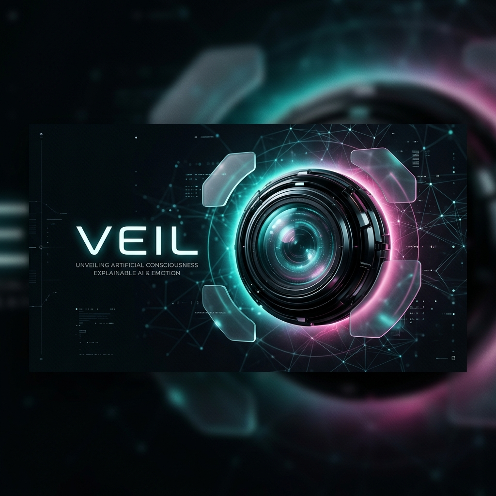
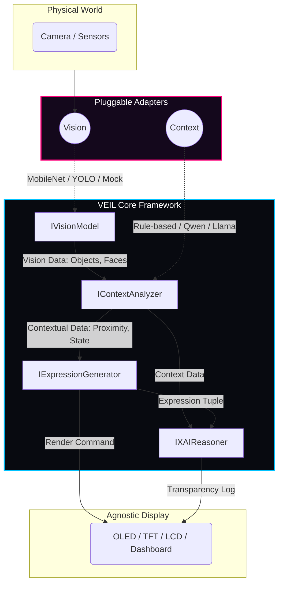

<div align="center">
  

  <h1>VEIL Framework</h1>
  
  <p><strong>A Model-Agnostic Framework for Robotic Emotional Expression & Explainable AI (XAI)</strong></p>
  
  <p>
    <a href="https://github.com/symbeon-labs/veil-core"></a>
    <a href="https://github.com/symbeon-labs/veil-core"></a>
    <a href="https://github.com/symbeon-labs/veil-core"></a>
  </p>
</div>

---

## 👁️ What is VEIL?

**VEIL** (Visual Expression & Inference Language) is a sovereign, hardware-and-model agnostic framework designed for autonomic robotic systems. Instead of hardcoding emotional responses to specific hardware or tethering behavior to proprietary AI models, VEIL provides a robust, standardized pipeline to translate environmental stimuli into Explainable, Auditable Emotional Expressions.

Whether running deterministic rules on an `$4 ESP32` or complex localized large language models (LLMs) on high-end hardware, VEIL ensures complete separation of concerns through an **Adapter-based Interface System**.

## 🏗️ Core Architecture (The VEIL Pipeline)

VEIL intercepts the chaos of the physical world and refines it through four strict mathematical/abstract interfaces:



### The 4 Pillars of VEIL

1. 📷 **`IVisionModel`**: Normalizes visual input. Standardizes detections (faces, objects, scene semantics) regardless of the underlying model (MobileNetV3, YOLO, OpenCV, or mock testing).
2. 🧠 **`IContextAnalyzer`**: The cognitive engine. Maps raw environmental stimuli and internal system state into contextual dimensions (interaction type, proximity, raw emotional inferences). Supports graceful degradation (from 4-bit Quantized LLMs down to fallback Rule-Based systems).
3. 🎭 **`IExpressionGenerator`**: The heart of VEIL. Maps contextual analysis into the standardized VEIL Expression Tetrad: *[Shape, Color, Intensity, Effect]* using dimensional psychology (Valence & Arousal).
4. 🔎 **`IXAIReasoner`**: The Explainable AI module. Generates human-readable, auditable semantic graphs explaining *why* the agent synthesized a specific emotional state.

## 🚀 Why "Model-Agnostic"?

Tethering a robotics project to a single LLM or Vision Model is a fatal bottleneck. Models deprecate every 6 months. **Frameworks scale forever.**

- **Scale to Edge:** You can hot-swap a heavy GPU model for a lightweight rule-based adapter when deploying to offline microchips.
- **Maintain Intellectual Property:** The value of VEIL is the *Language Translation Pipeline* (Raw Data → Emotional State Protocol), not the transient models used to infer the data.
- **Academic & Patent Grade:** Built for high transparency and standard compliance, ideal for grant applications and privacy regulation (GDPR/LGPD).

## 🗂️ File Structure Snapshot

```bash
/
├── backend/                  # The Central Nervous System
│   ├── veil_core/            # The Model-Agnostic Framework Definitions
│   │   ├── interfaces.py     # IVisionModel, IContextAnalyzer...
│   │   ├── config.py         # Dependency Injection rules (Edge vs Cloud)
│   │   └── adapters/         # Swappable models (e.g. vision_mock_adapter.py)
│   └── routes/               # API Telemetry routes
├── frontend/                 # Interactive Dashboard & Simulator (React)
├── firmware/                 # ESP32 C++ Embeddable Layer
└── docs/                     # Academic Papers, Patents, and Funding Strategies
```

## 📜 Sovereign Commitment

VEIL was originally sanitized by the **AEGIS Protocol**. This codebase contains:
- ❌ **Zero** undocumented telemetry
- ❌ **Zero** passive marketing injected by AI generation platforms
- ✅ **100%** local execution capability

___

*A project by symbeon-labs | Overseen by SH1W4*
