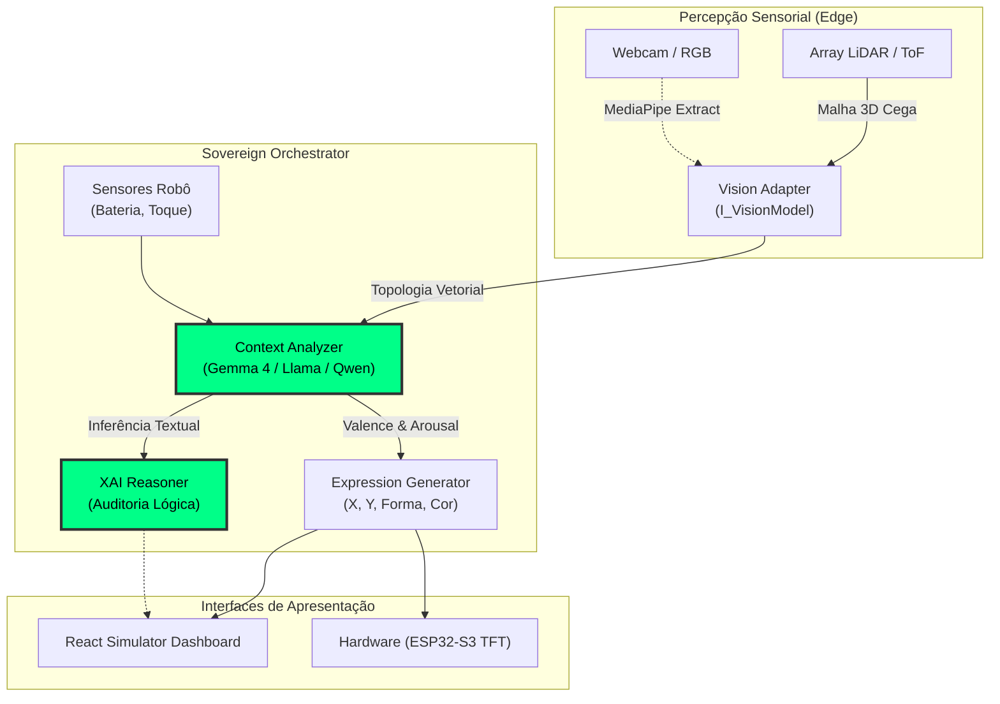

<div align="center">


# VEIL Core: Visual Emotional Interface Language

**Sovereign Edge Framework para Inteligência Emocional Agnóstica & Robótica Segura.**

[](LICENSE)
[](docs/strategy_and_lidar_research.md)
[](scripts/attest_veil_ueap.js)
[](backend/veil_core/config.py)
</div>

---

## 🌌 Visão Geral

O **VEIL** não é apenas um projeto de robótica mecânica; é um **framework hiper-maturo, soberano e agnóstico de hardware/modelo** que traduz nuances topográficas do mundo real em expressões robóticas justificáveis (XAI - *Explainable AI*).

Diferente de sistemas preexistentes (como drivers que leem imagens RGB ou atuam sob nuvens centralizadas), o VEIL foi fundado no **Protocolo de Privacidade Dimensional**: nós descartamos fotografias. O VEIL compreende apenas pontuações no espaço tridimensional (pontos biométricos de tensão capturados via LiDAR/Time-of-Flight) e infere estados psicológicos complexos utilizando IAs locais em hardware restrito (Edge Computing).

## 🏗️ Super-Arquitetura Modular

A fundação do VEIL é composta de `Adapters`. Absolutamente qualquer camada pode ser subtituída no arquivo [config.py](backend/veil_core/config.py).



## 🛡️ Pipelines Principais

### 1. `Aegis Harvester` (Soberania de Dados)
Como não dependemos de imagens da pele de um ser humano, como estruturar o dataset? O `scripts/aegis_harvester.py` puxa feeds públicos, extrai as malhas 3D (`Mesh Point Cloud`), injeta um pseudo-label do VLM (Valência/Excitação) e **incinera eternamente o Frame RGB Original**. O resultado é o `veil_finetuning_substrate.jsonl`, permitindo conformidade máxima na GDPR/LGPD hospitalar.

### 2. UEAP Zero-Trust Attestation
Datasets biomédicos na IA exigem auditoria rigorosa. Este repositório integra formalmente o **Universal Event Attestation Protocol (UEAP)**. 
Após cada colheita pelo Harvester, executamos `scripts/attest_veil_ueap.js` que tira um Hash SHA-256 da malha invisível e escreve uma prova _ZK-SNARK_ rastreável, atestando que os dados emocionais não sofreram contaminação posterior e são éticos.

### 3. Integração Dinâmica UI-to-Core
O painel em `/frontend` não é mais uma maquete. Ele possui um **Motor de Percepção Neural** que realiza chamadas assíncronas HTTP (`POST /api/veil/process`) engatando os dados simulados contra os pesos do _Python Orchestrator_ verdadeiro e alterando a face do olho em tempo real.

---

## 🚀 Como Subir o Córtex Local

Você pode iniciar as metades lógicas e de interação simultaneamente na sua máquina.

### Backend (Sovereign Python Orchestrator)
```bash
cd backend
python -m pip install -r requirements.txt
python -m uvicorn server:app --reload --port 8000
```

### Frontend (React Dashboard & Analytics)
```bash
cd frontend
npm install
npm start
```
*Acesse seu navegador em `localhost:3000` e pressione o botão "Ativar Percepção Neural" na Engine direita para ver a mágica XAI justificada na tela.*

---

## 📜 Propriedade Intelectual & P&D
A fundação operacional completa, as especificações acadêmicas detalhadas do framework LiDAR e as minutas das reivindicações mecânicas da arquitetura agnóstica podem ser auditadas dentro do diretório de patentes: `/docs/`
