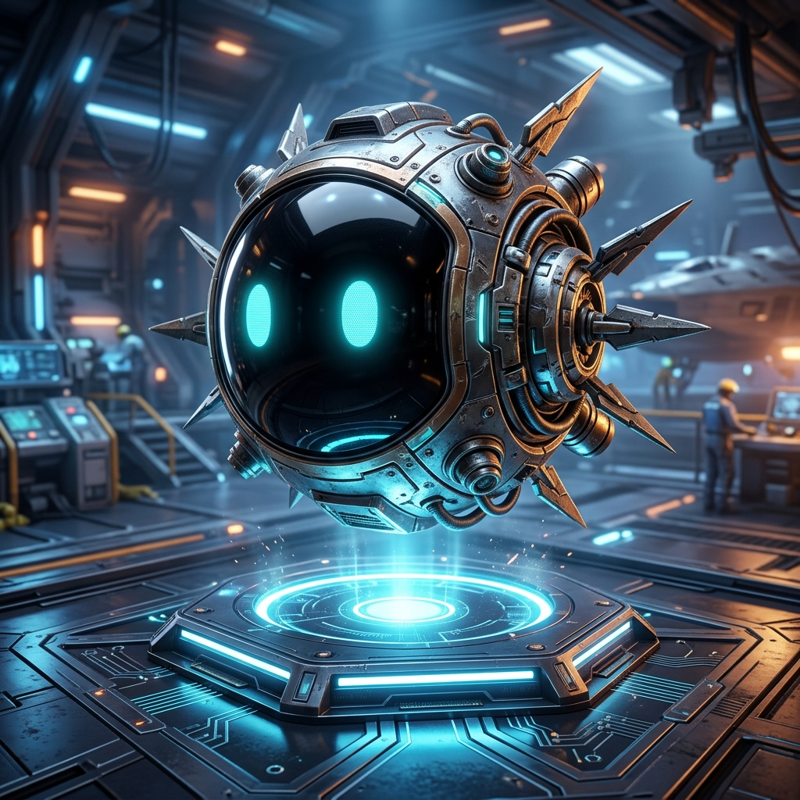

# VEIL: O.R.B. Reference Hardware (Orbital Resonance Body)
*Esquema Oficial de Montagem da Física do Oráculo VEIL*

  

---

## 🏗️ Filosofia de Hardware do VEIL O.R.B.
Como o framework exige a extração Topográfica pesada da Valência humana e o acionamento via Orquestradores LLM (Gemma/Qwen), não podemos pesar as partes móveis do robô.
A solução do **VEIL O.R.B. (Orbital Resonance Body)** usa a separação radical: a esfera que flutua tem apenas peso para se comunicar por Bluetooth e brilhar, enquanto todo o processamento massivo, pesagem magnética e o LiDAR estão ocultos, acoplados à gravidade na base de indução.

---

## 📦 Bill of Materials (Lista de Componentes)

### 1. A ORBE FLUTUANTE (Módulo Visor)
Tudo aqui dentro deve pesar no máximo **150 a 250 gramas** para sustentar a levitação suave.
*   **Carcaça Espacial**: Impressa em 3D (Resina SLA ou PETG) em forma de concha de duas partes encaixáveis. Pintada em *Matte Dark Space*.
*   **Display de Interface (Os Olhos)**: `Display LCD IPS Circular 1.28" (GC9A01)`. Ele é perfeitamente curvo para dar o acabamento embutido do visor frontal.
*   **Microcontrolador (O Nervo Visual)**: Placa `ESP32-S3 SuperMini`. Extremamente magra, possuindo Wi-Fi e Bluetooth BLE nativo para espelhar as ordens geométricas do backend.
*   **Receptor de Energia (Alimentação Infinita)**: Modulo "Wireless Charging Receiver Coil" (Bobina receptora de indução). A Orbe não requer bateria pesada recarregável. Retira eletricidade do campo eletromagnético enquanto flutua.
*   **Imã Flutuador**: O ímã de neodímio em formato de prato fornecido junto com o módulo de levitação. A carcaça abraça esse ímã por baixo.

### 2. A BASE DE GRAVIDADE (Córtex Analítico)
Este é o bloco sólido na sua mesa. O módulo pesado e pensante conectado diretamente à internet (e ao Symbeon Protocol HAAS / Membrane SDK).
*   **Chassis da Base**: Um octógono com ranhuras industriais, impresso em 3D (PLA / ABS).
*   **O Motor Magnético**: `Módulo de Levitação Magnética Eletromagnética Coreana (com sensores Hall integrados)` que corrige a posição do ímã 60 vezes por segundo no ar.
*   **Bobina de Transmissão de Força**: "Wireless/Inductive Charging Transmitter Coil". Sobe 5V invisíveis até a Orbe flutuante cruzando o campo eletromagnético da base.
*   **O Computador Host (Córtex de Criptografia)**: Um `Raspberry Pi 5`, `NVIDIA Jetson Nano` ou a própria CPU pesada do seu computador Desktop conectado via ponte Serial C. (Irá rodar os scripts LLM de ZK-Proof localmente e o Córtex XAI).
*   **O Sensor LiDAR (A Retina Soberana)**: Câmera Stereoscópica/Câmera de Profundidade Embutida na face inferior da Base (Ex: Intel RealSense D435i ou Matriz ToF passiva), focada em mapear o rosto humano com privacidade topológica cega e despachar a matriz via Python para o LLM julgar.

---

## 🔌 Lógica de Ligação Neural (Network Flow)
A magia acontece de forma dividida:

**Passo 1 (Base/Harvester):** A malha LiDAR varre a mesa e coleta as 468 coordenadas tensas do seu maxilar. Passa pro Orquestrador (Raspberry / Host PC da Base).
**Passo 2 (Inferência Cognitiva):** O LLM local da Base diz: `"Stressed Arousal, Reject Consensus"`. Emite um JSON ZK-Proof na hora bloqueando a ação.
**Passo 3 (O Espelho Tátil):** O Python do Host da Base manda uma String invisivel pelo Bluetooth para a Orbe Flutuante. Exemplo rápido: `{"shp":"diamond", "col":"#FF0055", "eff":"shake"}`. 
**Passo 4 (O Deslumbramento):** O ESP32 no ar desenha 60fps de geometria reagindo de foma natural com a cor exigida. O ser humano sequer nota com toda a magia flutuante que sua telemetria neural fechou contratos criptográficos na Base abaixo dela.
